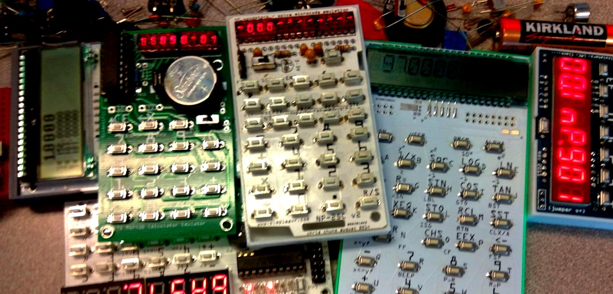

  

## SimpleAvr Projects

  
 

**`[June, 2023]`** add [S14 Clock](s14clock) project

**`[July, 2018]`** creation of this launch page which should eventually host all of my published projects

### Microcontroller Projects since 2010, mostly TI MSP430 devices

I am consolidating all of my projects in github and is moving all the project pages here. Some of these projects are quite old and I am not able to support them anymore. Source codes are available for your experimentation and I cannot guarantee usability and success of any of my projects.

In no particular order

[S14 Clock](s14clock) Bar shaped, web synchronized word clock featuring 24 or 12 characters, 14 segment LED display.

[TMS0803/5 Emulating Calculator Build](tms0800) MSP430G2452 acting as a TMS0803 calculator chip. Emulates TI DataMath 2500II and Sinclair Scientific Calculators.

[NP25 Calculator Build](NP25) msp430 Based Calculator Emulator for the HP-21, HP-25C, and HP-33C Calculators.

[3p4w Clock](old_projects/3p4w_clock) 3 Parts 4 Wires Clock. Digital clock with absolute minimal parts.

[Breadboard Collection](breadboard_collections) A collection of MSP430 mini projects (mostly LED) that requires no soldering and can be easily assembled w/ a 170 tie-point mini-breadboard.

-   [5P4W Clock](breadboard_collections/5p4w_clock) 5 Parts 4 Wires Clock. Digital clock built with minimal components and wirings.
-   [Kitchen Timer](breadboard_collections/ktimer) Single Digit Kitchen Timer. Simple Construction.
-   [Simon Game](breadboard_collections/simon) Minimalist's Simon Game on a Breadboard.
-   [Tix Clock](breadboard_collections/tix) Tix Clock Implemented In a Gem Mine Diorama.
-   [Audio Spectrum Analyzer](breadboard_collections/nfft) Breadboard Audio Spectrum Analyzer.
-   [M-Clock](breadboard_collections/mclock) Minimalist's Clock? Multi-mode Clock? Matrix Clock?
-   [Joule Thief LED Tree](breadboard_collections/jt_ledtree) A minimalist 1.5V coin cell led tree with all components and power source confined within a mini breadboard.
 
[8 Bit FFT Spectrum Analyzer](lp_8bitfft) 8 bit FFT Audio Spectrum Analyzer on a TI LaunchPad with Educational BoosterPack.

[Bad Apple](old_projects/bad_apple) Jukebox Like Device Plays Bad Apple Meme.

[Compact Audio Spectrum Analyzer](msp430_msgeq7) 7 Band Compact Audio Sprectrum Analyzer based on msgeq7 and msp430 MCU.

[EZ430Trainer](old_projects/ez_trainer) A Retro Style Basic Computer.

[Ezprobe](old_projects/ez_probe) Logic Probe and More Multi-tester Based on the TI EZ430 USB Development Stick.

[LaunchPad Shield](old_projects/launchpad_shield) A DIY Breadboard Shield for the TI Launchpad, and RGB Led Driving Example.

[RFM12b Spectrum analyzer](old_projects/rfm12b_spectrum_analyzer) RF Spectrum Analyzer Based on the TI Launchpad and the RFM12b RF Module.

[RTC Clock](rtc-clock) A minimalist digital clock with crystal time keeping.

[TI LaunchBread](old_projects/launchbread) Breadboard Development and Programming with the TI msp430 Value Line MCUs.

**AVR Projects**

- [hvsp fuse resetter](old_projects/avr_fuse) Resets Certain AVR devices fuses via High-voltage Programming.
- [multimode clock](old_projects/avr_clock) Breadboard based clock Project with atttiny2313 Microcontroller.
- [vusbtiny programmer](old_projects/avr_vusbtiny) Simple and Tiny AVR Device Programmer.

